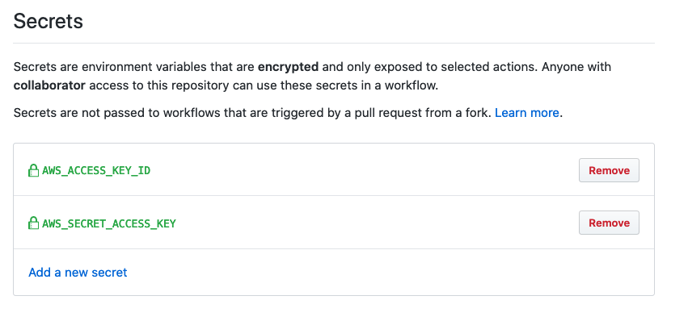
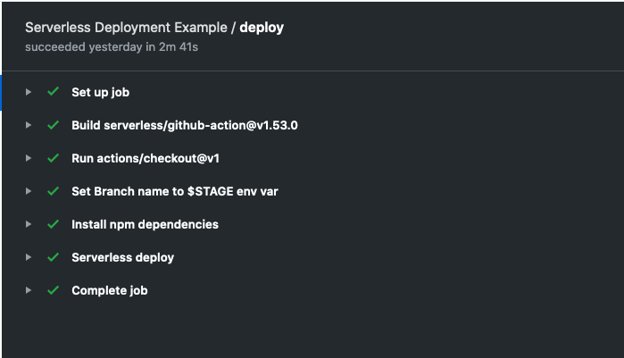
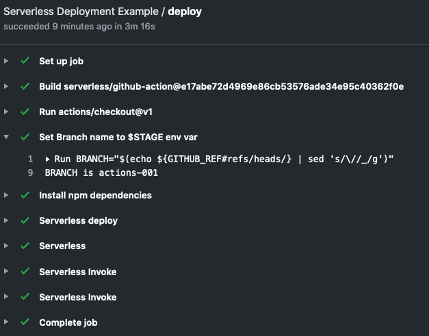
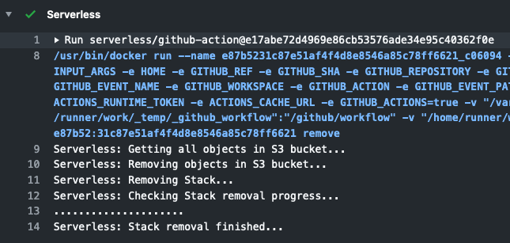

# Github Actions with Serverless Example

A example deployment for Github Actions with Serverless Framework. 

# Installation

* Fork this repo
* Populate `AWS_ACCESS_KEY_ID` and `AWS_SECRET_ACCESS_KEY` in GitHub secrets in your forked repo

# Usage

## Deploy Develop Branch

To create a new environment, create a branch called `develop` and push new code into it.

    $ git checkout -b develop
    $ git commit --allow-empty -m "trigger GitHub actions"
    $ git push --set-upstream origin develop

You can then view the actions being run in the actions tab on your GitHub repository:

By default environments are deployed in `ap-southeast-1`, you can modify this in the serverless.yml file in provider.region.

The standard resources deployed are:

* One hello lambda function (at-<branch_name>-hello)
  * With IAM role hello-role-<branch_name>
* One goodbye lambda function (at-<branch_name>-goodbye)
  * With IAM role goodbye-role-<branch_name>
* One step function, that chains the two lambd functions together
  * With IAM role at-<branch_name>-HelloUnderscoreandUnderscoregoodbyeDash-##random##
* Additional resources like deployment bucket, created by the serverless framework

## Deploy feature branch

To create a feature branch, and the corresponding environment for it

    $ git checkout -b actions-001
    $ git commit --allow-empty -m "trigger GitHub actions"
    $ git push --set-upstream origin actions-001

And you can see newly created resources in the region of choice, with new <branch_name>

## Delete feature branch

Once a feature branch is merged into develop (or master), you can delete the branch to triggere the removal of that branch's environment.

    $ git push origin --delete actions-001

All corresponding resources in that branch's environment will be permanently deleted.∂

